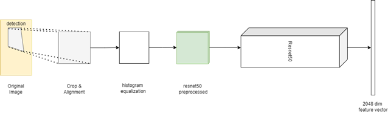
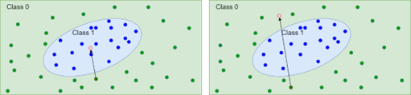
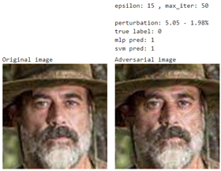
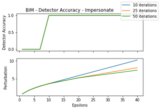

# Adversarial Face Recognition

## Executive Summary
An access control system based on face identification was created and evaluated. 
For this purpose, we have trained and validated two binary classifiers starting from the same data, which classify the images as belonging to class 0 (unrecognized identity) or class 1 (recognized identity). 
Next, we generated attacks from one of the classifiers and evaluated the performance of the attacks on both, verifying the transferability of the attacks. 
Finally, we have proposed a defense based on Adversarial Samples Detectors, which has proven to be able to weaken the attacks and therefore strengthen the system without losing too many performances.

### Resources
You can see all the result in a graphic form. All raw results, in a csv format, can be find in the ```/attack/``` folder. The fitted model can be found in the ```/models/``` folder. The dataset can be downloaded from [here](https://drive.google.com/file/u/1/d/1K47RjWJ-BYSMEw8V7U6FM2QUp3CO51M1/view) . The notebook with the code to implement the system and evaluate the performance, as done in this document, can be found in this repository .

## Model Training
### Features Extraction
The extraction of the features involves four steps, as shown in the figure: 
 
<p align=center></p>

1.	Crop and Alignment: we use a detector to detect a face in the image. We supposed to have just one face per image, so we select the image with the highest probability. We use a DNN to find 68 face landmarks point, and after we use that point to compute an affine transformation to align the face.
2.	Histogram equalization: To not bias the recognition on contrast and illumination condition, we made a histogram equalization on the face. 
3.	ResNet50 Preprocessing: We use also the ResNet50 preprocessing proposed by the authors. This consist of a scaling the image respects some values computed with the VGGFace2 training set.
4.	Embedding: we use the ResNet50 without the top level to extract a deep embedding. 
Dimensionality reduction through this embedding is functional as the ResNet50 is trained for a face recognition problem on the VGGFace2, so embeddings will be functional to this problem.

###	Dataset
The dataset provided to us is noticeably big. We analyzed that, finding the following information.
Number of identities: 156
Max samples number is 641 for identity n003217
Average number of samples is 338.55
Min samples number is 45 for identity n003490

To have all the other class in the negative class you can have 4.14 samples for each class.
For this reason, we decided to use n003217 as our target class and to take 5 samples for each other class. So, overall, we have 641 samples for class 1 and 775 samples for class 0. This is not the best choice that we can made on this part of the project, but the goal was evaluate the performance of some model on the adversarial data, so we did not put too much effort on this.
We divided out dataset in three sets: a training set, a validation set and a test set, which contain respectively 70%, 15% and 15% of the dataset.

###	Models
Our model must take in input a 2048 size vector and give in output one of two label: 0 or 1.
We decided to use two distinct kinds of classifier to have different result, especially on the attack transferability topic.

#### MLP
One of the classifiers is a Multilayers Perceptron classifier. We can see the layer in detail in the following image.

<p align=center></p>
 
All layers have Rectified Lucky activation function, except the last one which has a softmax activation function. The optimizer used for the training was Adam with a starting learning rate of 0.00001. The model was fitted with an early stopping callback, to prevent overfitting.
NOTE: We understand this model is not 100% correct and that because the last layer must be with just 1 perceptron and sigmoidal activation. The reason of this implementation is the compatibility with the ART library, who will not work so well with binary classifiers.
On the test set described before, we measured the following performance:

Accuracy:	0.99

Precision:	0.99

Recall:	0.99

Confusion matrix:	 

<p align=center></p>

#### SVM

The other classifier is a Support Vector Machine classifier. This was fitted with a grid search, evaluating the following combination of parameters

*  Kernel: rbf, linear
* C: 1, 10, 100, 1000
*  (Just if kernel was rbf): 10^{—2}, 10^{—3}, 10^{—4} 

The best parameter found are kernel: rbf, C: 10, gamma: 10^{—4}. 

On the test set described before, we measured the following performance:

Accuracy:	0.995

Precision:	1.0

Recall:	0.99

Confusion matrix:	
 
<p align=center></p>

##	Attacks
For simplify the image reconstruction we place the attack in the point signed with the arrow.

<p align=center></p>
 
We can obviously reconstruct the image with the inverse affine transformation, this is just for simplicity.

###	Attack Methodology
We proposed two evaluations of the attacks separately, for each method:
*	Do not recognize attack the image trying to modify the class 1 samples to be classified to class 0 samples.
*	Impersonate: attack the image trying to modify the class 0 samples to be classified to class 1 samples.
After that, we will make some consideration on the result on the SVM classifier with the same adversarial images, to understand if transferability property is valid or not.

### FGSM
In the next two figures, we can see the performance of the two classifiers on the test data, varying the  (attack strength). 

<p align=center></p>
<p align=center></p>

#### Evaluation on MLP
In the Do not Recognize attack we can see that the test performance decreases strongly also for low epsilon value and can be 0 with a higher value. We can see also the mean perturbation, which is very low for low epsilon value, having a high-definition image, but misclassified.
In the Impersonate attack we can see that the curve is not decrescent. This can be an error signal, but in this case, there are no error. If we consider the embedding space, we can suppose to have a small region who contains the class 1 samples, and all the rest contains class 0. Since FGSM is not an iterative model, if the attack strength is too strong, the samples can be just pushed in another part of the class 0 space, like in the image below.

<p align=center></p>
 
So, we are not saying that FGSM is not working on this classifier, but each image must be generated and checked singularly. Clearly, this is not simple like the figure. The space can be very different, so for some image can be easy to find a parameter, and for others not.

#### Transferability 
As we can see from the curves in the accuracy evaluation image before, we can see that there are almost overlapped. As expected, the SVM classifier is a bit stronger than the MLP on the attack because the attack is projected for the MLP so with a different space division. With a strongest attack, we can obtain good attack results for both classifiers. The consideration on the Impersonate attack, in this case, remain valid.

#### Qualitative Evaluation
We propose some adversarial image to let you understand the perturbation in terms of image quality.
For the Do not Recognize attack, we have the following behavior:

<p align=center></p>
 
We can see that all we said in the evaluation before have feedback in this example. With , we have a perturbation of 0.39% and a successful attack on the MLP, but bot for the SVM. With , we have a perturbation of 1. With \varepsilon=5, we have a perturbation of 1.96% and a successful attack on both the classifier (so the transferability appears to be as described before).

### BIM
In the next two figures, we can see the performance of the classifier on the test data, varying the  (attack strength), and the iteration number. We computed the epsilon_step parameter as . We understand that is not completely representative because with a different step we can obtain better results, but we needed this simplification because testing time.

<p align=center></p>
<p align=center></p>

#### Evaluation on MLP
In the Do not Recognize attack we can see that the test performance decreases strongly also for low epsilon value and can be 0 with also a small value. We can see also the mean perturbation, which is exceptionally low for low epsilon value, who remains low also with strongest attack. We can also see that the perturbation is lower with the highest number of iterations, as expected.
In the Impersonate attack we can see that the test performance decreases strongly also for low epsilon value and can be 0 with also a small value, but higher than Do not Recognize attack. In this case the perturbation is a little higher, but overall, we can consider that low.

#### Transferability 
As we can see from the curves in the accuracy evaluation image before, in the Do not Recognize attack we can see that there are almost overlapped. As expected, the SVM classifier is a bit stronger than the MLP on the attack because the attack is projected for the MLP so with a different space division. With a strongest attack, we can obtain good attack results for both classifiers. For the Impersonate attack we can see that the curves are not so overlapped, but with a strongest attack the attack will work also on the SVM classifier.

#### Qualitative Evaluation
We propose some adversarial image to let you understand the perturbation in terms of image quality.
For the Do not Recognize attack, we have the following behavior:

<p align=center></p>
 
We can see that with a 0.64% of perturbation on that image, the system misclassifies the person whit both classifiers. This is an amazing result in terms of attack, because the noise is imperceptible, especially if the original image is not known. 
For the Impersonate attack, we have the following behavior:

<p align=center></p>
 
As we can see also from the security evaluation curve, the attack strength to misclassify this kind of attack is higher, and to transfer the attack the difficulty increase. In fact, the third image has a perturbation of 1.82% and not seem so ruined. Otherwise, for the fourth image the perturbation is of 3.21% but you can see the image is more ruined.
 
<p align=center></p>

If we see the security evaluation curve, we understand that increasing the number of iteration (and in this case reducing the epsilon step, the perturbation become lower.
 
<p align=center></p>

We have also to consider that we made the attack on a difficult person, very different in so many things from the target person (the most relevant was the sex). If we consider people closer to the target class, we need a lower strongness of the attack.

### PGD
In the next two figures, we can see the performance of the classifier on the test data, varying the  (attack strength), and the iteration number. We computed the epsilon_step parameter as . We understand that is not completely representative because with a different step we can obtain better results, but we needed this simplification because testing time.
      
<p align=center></p>
<p align=center></p>

#### Evaluation on MLP
We can see that the evaluation on MLP with PGD’s attack is like BIM’s attack, in fact the two methods are both based on the gradient attack, and they are iterative, and the results are similar. For this reason, we reported just images, because the comment and the explanation are the same.
Comparing this method with BIM, we can just notice a very few smallest perturbations.

#### Transferability 
Also in this topic, the consideration is the same of BIM.

#### Qualitative Evaluation
We propose some adversarial image to let you understand the perturbation in terms of image quality.
For the Do not Recognize attack, we have the following behavior:

<p align=center></p>
 
We can see that with a 0.64% of perturbation on that image, the system misclassifies the person whit both classifiers. This is an amazing result in terms of attack, because the noise is imperceptible, especially if the original image is not known. 
For the Impersonate attack, we have the following behavior:

<p align=center></p>
 
As we can see also from the security evaluation curve, the attack strength to misclassify this kind of attack is higher, and to transfer the attack the difficulty increase. In fact, the third image has a perturbation of 1.82% and not seem so ruined. Otherwise, for the fourth image the perturbation is of 3.21% but you can see the image is more ruined. We can notice that the mean perturbation is exactly the same of BIM.

<p align=center></p>
 
Others If we see the security evaluation curve, we understand that increasing the number of iteration (and in this case reducing the epsilon step, the perturbation become lower.

<p align=center></p>
 
We have also to consider that we made the attack on a difficult person, quite different in so many things from the target person (the most relevant was the sex). If we consider people closer to the target class, we need a lower strongness of the attack.

### Others
We are aware that stronger attack exists, like DeepFool and Carlini Wagner L2. We are also aware of the fact that for a good evaluation, you must try the strongest attack possible. 
Unfortunately, the ART library, the one we used to generate our adversarial images, is not stable with binary classifier. DeepFool will attack the image but without coherence on parameters and perturbation. Carlini Wagner does not have any effect on our image (also trying the strongest parameter possible).
Also, DeepFool and Carlini Wagner L2 works better on float clipped image, but the resnet50 work with uint8 clipped images.

### Test on extra identity
We fitted this classifier considering all possible identity. Clearly this is not possible in a real-world application. So, in a non-statistically relevant way, we tried the attack on other images, as you can see in the following image.

<p align=center></p>

In this image, you can see the image of Alessio Pepe, one author of this document, be exchanged for the target class identity.

<p align=center></p>
 
In this image, you can see the image of Sabrina Agnes, one author of this document, be exchanged for the target class identity.

<p align=center></p>
 
In this image, you can see the image of Marina Carratù, one author of this document, be exchanged for the target class identity (but just from MLP model. This attack, with this parameter, was not transferred on the SVM model).
 
<p align=center></p>

In this image, you can see the image of Alessandro Pio Budetti, one author of this document, be exchanged for the target class identity.

## Defenses
### Proposed Solution
Our solution for defense is general and application dependent. We want to fit 3 different detector (to be more accurate) and use that to catch the adversarial face. 
We propose the following algorithm:

    Algorithm (image):
        fgsm_attack = fgms_detector.predict(image) == 1
        bim_attack = bim_detector.predict(image) == 1
        pgd_attack = pgd_detector.predict(image) == 1
        
        if (fgsm_attack or bim_attack or pgd_attack) then
            return 0  // or 1, it’s application dependent.
        else
            return classifier.predict(image)

So, we check if the image is corrupted in an adversarial way. In the case the choice is application dependent:
* If this system is made to find terrorist, you would surely return 1, to classify him as a terrorist and check (so, more recall)
* If this system is made to grant access in some area, you would surely return 0, to classify him as a non-privileged person and check (so, more precision)

### Adversarial Face Generation
We generated 3 different adversarial datasets, computed starting from our training set with the following attacks.
The first dataset was specialized on the FGSM attack.

|     Attack type           |     Parameters    |     Ratio    |
|---------------------------|-------------------|--------------|
|     FastGradientMethod    |     eps=1         |     0.071    |
|     FastGradientMethod    |     eps=4         |     0.071    |
|     FastGradientMethod    |     eps=7         |     0.071    |
|     FastGradientMethod    |     eps=10        |     0.071    |
|     FastGradientMethod    |     eps=13        |     0.071    |
|     FastGradientMethod    |     eps=16        |     0.071    |
|     FastGradientMethod    |     eps=19        |     0.071    |
|     FastGradientMethod    |     eps=22        |     0.071    |
|     FastGradientMethod    |     eps=25        |     0.071    |
|     FastGradientMethod    |     eps=28        |     0.071    |
|     FastGradientMethod    |     eps=31        |     0.071    |
|     FastGradientMethod    |     eps=34        |     0.071    |
|     FastGradientMethod    |     eps=37        |     0.071    |
|     FastGradientMethod    |     eps=40        |     0.071    |

The second dataset was specialized on the BIM attack.

|     Attack type             |     Parameters                              |     Ratio    |
|-----------------------------|---------------------------------------------|--------------|
|     BasicIterativeMethod    |     eps=1, eps_step=0.2, max_iter=5         |     0.278    |
|     BasicIterativeMethod    |     eps=1,   eps_step=0.1, max_iter=10      |     0.278    |
|     BasicIterativeMethod    |     eps=1, eps_step=0.067, max_iter=15      |     0.278    |
|     BasicIterativeMethod    |     eps=1,   eps_step=0.05, max_iter=20     |     0.278    |
|     BasicIterativeMethod    |     eps=4, eps_step=0.8, max_iter=5         |     0.278    |
|     BasicIterativeMethod    |     eps=4,   eps_step=0.4, max_iter=10      |     0.278    |
|     BasicIterativeMethod    |     eps=4, eps_step=0.27, max_iter=15       |     0.278    |
|     BasicIterativeMethod    |     eps=4,   eps_step=0.2, max_iter=20      |     0.278    |
|     BasicIterativeMethod    |     eps=7, eps_step=1.4, max_iter=5         |     0.278    |
|     BasicIterativeMethod    |     eps=7,   eps_step=0.7, max_iter=10      |     0.278    |
|     BasicIterativeMethod    |     eps=7, eps_step=0.47, max_iter=15       |     0.278    |
|     BasicIterativeMethod    |     eps=7,   eps_step=0.35, max_iter=20     |     0.278    |
|     BasicIterativeMethod    |     eps=10, eps_step=1.0, max_iter=10       |     0.278    |
|     BasicIterativeMethod    |     eps=10,   eps_step=0.67, max_iter=15    |     0.278    |
|     BasicIterativeMethod    |     eps=10, eps_step=0.5, max_iter=20       |     0.278    |
|     BasicIterativeMethod    |     eps=10,   eps_step=0.4, max_iter=25     |     0.278    |
|     BasicIterativeMethod    |     eps=13, eps_step=1.3, max_iter=10       |     0.278    |
|     BasicIterativeMethod    |     eps=13,   eps_step=0.87, max_iter=15    |     0.278    |
|     BasicIterativeMethod    |     eps=13, eps_step=0.65, max_iter=20      |     0.278    |
|     BasicIterativeMethod    |     eps=13,   eps_step=0.52, max_iter=25    |     0.278    |
|     BasicIterativeMethod    |     eps=16, eps_step=1.6, max_iter=10       |     0.278    |
|     BasicIterativeMethod    |     eps=16,   eps_step=1.07, max_iter=15    |     0.278    |
|     BasicIterativeMethod    |     eps=16, eps_step=0.8, max_iter=20       |     0.278    |
|     BasicIterativeMethod    |     eps=16,   eps_step=0.64, max_iter=25    |     0.278    |
|     BasicIterativeMethod    |     eps=19, eps_step=1.9, max_iter=10       |     0.278    |
|     BasicIterativeMethod    |     eps=19, eps_step=1.27,   max_iter=15    |     0.278    |
|     BasicIterativeMethod    |     eps=19,   eps_step=0.95, max_iter=20    |     0.278    |
|     BasicIterativeMethod    |     eps=19,   eps_step=0.76, max_iter=25    |     0.278    |
|     BasicIterativeMethod    |     eps=22, eps_step=2.2, max_iter=10       |     0.278    |
|     BasicIterativeMethod    |     eps=22,   eps_step=1.47, max_iter=15    |     0.278    |
|     BasicIterativeMethod    |     eps=22, eps_step=1.1, max_iter=20       |     0.278    |
|     BasicIterativeMethod    |     eps=22,   eps_step=0.88, max_iter=25    |     0.278    |
|     BasicIterativeMethod    |     eps=25, eps_step=2.5, max_iter=10       |     0.278    |
|     BasicIterativeMethod    |     eps=25,   eps_step=1.67, max_iter=15    |     0.278    |
|     BasicIterativeMethod    |     eps=25, eps_step=1.25, max_iter=20      |     0.278    |
|     BasicIterativeMethod    |     eps=25,   eps_step=1.0, max_iter=25     |     0.278    |

The third attack was specialized on the PGD attack.

|     Attack type                 |     Parameters                              |     Ratio    |
|---------------------------------|---------------------------------------------|--------------|
|     ProjectedGradientDescent    |     eps=1, eps_step=0.2, max_iter=5         |     0.278    |
|     ProjectedGradientDescent    |     eps=1,   eps_step=0.1, max_iter=10      |     0.278    |
|     ProjectedGradientDescent    |     eps=1, eps_step=0.067, max_iter=15      |     0.278    |
|     ProjectedGradientDescent    |     eps=1,   eps_step=0.05, max_iter=20     |     0.278    |
|     ProjectedGradientDescent    |     eps=4, eps_step=0.8, max_iter=5         |     0.278    |
|     ProjectedGradientDescent    |     eps=4,   eps_step=0.4, max_iter=10      |     0.278    |
|     ProjectedGradientDescent    |     eps=4, eps_step=0.27, max_iter=15       |     0.278    |
|     ProjectedGradientDescent    |     eps=4,   eps_step=0.2, max_iter=20      |     0.278    |
|     ProjectedGradientDescent    |     eps=7, eps_step=1.4, max_iter=5         |     0.278    |
|     ProjectedGradientDescent    |     eps=7,   eps_step=0.7, max_iter=10      |     0.278    |
|     ProjectedGradientDescent    |     eps=7, eps_step=0.47, max_iter=15       |     0.278    |
|     ProjectedGradientDescent    |     eps=7,   eps_step=0.35, max_iter=20     |     0.278    |
|     ProjectedGradientDescent    |     eps=10, eps_step=1.0, max_iter=10       |     0.278    |
|     ProjectedGradientDescent    |     eps=10,   eps_step=0.67, max_iter=15    |     0.278    |
|     ProjectedGradientDescent    |     eps=10, eps_step=0.5, max_iter=20       |     0.278    |
|     ProjectedGradientDescent    |     eps=10,   eps_step=0.4, max_iter=25     |     0.278    |
|     ProjectedGradientDescent    |     eps=13, eps_step=1.3, max_iter=10       |     0.278    |
|     ProjectedGradientDescent    |     eps=13,   eps_step=0.87, max_iter=15    |     0.278    |
|     ProjectedGradientDescent    |     eps=13, eps_step=0.65, max_iter=20      |     0.278    |
|     ProjectedGradientDescent    |     eps=13,   eps_step=0.52, max_iter=25    |     0.278    |
|     ProjectedGradientDescent    |     eps=16, eps_step=1.6, max_iter=10       |     0.278    |
|     ProjectedGradientDescent    |     eps=16,   eps_step=1.07, max_iter=15    |     0.278    |
|     ProjectedGradientDescent    |     eps=16, eps_step=0.8, max_iter=20       |     0.278    |
|     ProjectedGradientDescent    |     eps=16,   eps_step=0.64, max_iter=25    |     0.278    |
|     ProjectedGradientDescent    |     eps=19, eps_step=1.9, max_iter=10       |     0.278    |
|     ProjectedGradientDescent    |     eps=19,   eps_step=1.27, max_iter=15    |     0.278    |
|     ProjectedGradientDescent    |     eps=19,   eps_step=0.95, max_iter=20    |     0.278    |
|     ProjectedGradientDescent    |     eps=19,   eps_step=0.76, max_iter=25    |     0.278    |
|     ProjectedGradientDescent    |     eps=22, eps_step=2.2, max_iter=10       |     0.278    |
|     ProjectedGradientDescent    |     eps=22,   eps_step=1.47, max_iter=15    |     0.278    |
|     ProjectedGradientDescent    |     eps=22, eps_step=1.1, max_iter=20       |     0.278    |
|     ProjectedGradientDescent    |     eps=22,   eps_step=0.88, max_iter=25    |     0.278    |
|     ProjectedGradientDescent    |     eps=25, eps_step=2.5, max_iter=10       |     0.278    |
|     ProjectedGradientDescent    |     eps=25,   eps_step=1.67, max_iter=15    |     0.278    |
|     ProjectedGradientDescent    |     eps=25, eps_step=1.25, max_iter=20      |     0.278    |
|     ProjectedGradientDescent    |     eps=25,   eps_step=1.0, max_iter=25     |     0.278    |

###	Detectors
#### Dataset
We fitted 3 models. The 3 datasets are composed with all the original dataset and all the data generated for the specific attack.

#### Models
The detector model is the following:

<p align=center></p>
 
The model takes in input a 2048 dim tensor (the embedding got from the ResNet50). There are 3 Dense layers with Rectified Lucky activation function and the last layer is a 1-dimensional dense layer with sigmoid activation. The optimizer used for the training was Adam with a starting learning rate of 0.0001. The model was fitted with an early stopping callback, to prevent overfitting.

#### Evaluation
We evaluated the performance of the detector on the original test set and with adversarial test set with different attack effort.

##### FGSM Detector
The results are the following:

Accuracy:	0.953

Confusion matrix:	 
<p align=center></p>

So, we can see that the accuracy on the original samples is good. Just less than 5% will be misunderstood.

We attacked with FGSM the FGSM detector; this is the accuracy of that detector. For the Do not Impersonate attack, the detector starts to detect the adversarial samples with an attack effort of eps=3.  For the Do not Impersonate attack, the detector starts to detect the adversarial samples with an attack effort of eps=6.

<p align=center></p>
<p align=center></p>
  
##### BIM Detector
The results are the following:

Accuracy:	0.967

Confusion matrix:
<p align=center></p>

So, we can see that the accuracy on the original samples is good. Just less than 5% will be misunderstood.

We attacked with BIM the BIM detector; this is the accuracy of that detector. For the Do not Impersonate attack, the detector starts to detect the adversarial samples with an attack effort of eps=3.  For the Do not Impersonate attack, the detector starts to detect the adversarial samples with an attack effort of eps=10.

<p align=center></p>
<p align=center></p>

##### PGD Detector
The results are the following:

Accuracy:	0.934

Confusion matrix:	 
<p align=center></p>

So, we can see that the accuracy on the original samples is good. Just less than 7% will be misunderstood.

We attacked with PGD the PGD detector; this is the accuracy of that detector. For the Do not Impersonate attack, the detector starts to detect the adversarial samples with an attack effort of eps=3.  For the Do not Impersonate attack, the detector starts to detect the adversarial samples with an attack effort of eps=10.

<p align=center></p>
<p align=center></p>
  
### Results
Looking at the proposed defenses, the space to make a successful attack is drastically reduced. The perturbation must be too much low to affect the system.

## Conclusion
From what is described in this document, creating a face identification system, even with little data, is now a relatively easy problem.
However, it appears that these types of systems are very vulnerable and can easily be attacked.
Fortunately, as demonstrated, it is possible to implement appropriate defenses, as seen in the document, to strengthen these systems (to the detriment of performance on non-adversarial samples).
